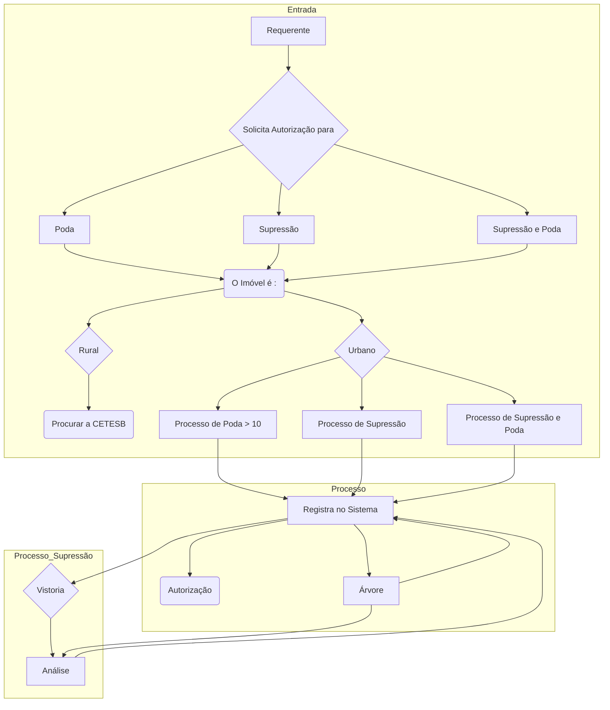

# Gestão de Arborização

```mermaid
graph TD

0[Processo de Poda]

    subgraph Entrada
    Req[Requerente] --> solicit{Solicita Autorização para}
    solicit --> poda[Poda]
    solicit --> supress[Supressão]
    solicit --> supresepoda[Supressão e Poda]
    0(O Imóvel é :)
    poda --> 0
    supress --> 0
    supresepoda --> 0
    urb{Urbano}
    rural{Rural}
    0 --> urb
    0 --> rural
    rural --> j(Procurar a CETESB)
    urb -->  p_poda[Processo de Poda > 10]
    urb --> p_supre[Processo de Supressão]
    urb --> p_suprepoda[Processo de Supressão e Poda]
    end 

    subgraph Processo
    p_poda --> registro[Registra no Sistema] --> autoriza(Autorização)
    registro --> arvore[Árvore] -->registro

    end

    subgraph Processo_Supressão
    vistoria{Vistoria}
    p_supre --> registro
    registro --> vistoria
    p_suprepoda --> registro
    vistoria --> analise
    analise[Análise]
    analise --> registro
    arvore --> analise
    end

```