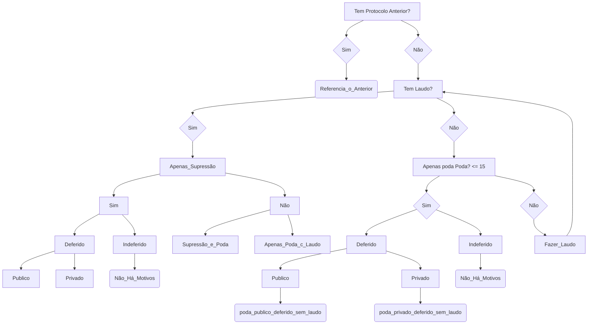

#### Fluxograma de Despachos

```mermaid
graph TD

a0[Tem Protocolo Anterior?]

a0 --> S0{Sim}
a0 --> N0{Não}
S0 --> Ref_Anterior(Referencia_o_Anterior)
N0 --> 0

0[Tem Laudo?]
0 --> S1{Sim}
0 --> N1{Não}

N1 --> poda0[Apenas poda Poda? <= 15]

poda0 --> S2{Sim}
poda0 --> N2{Não}
Fazer_Laudo --> 0

S2 --> def1[Deferido]
S2 --> indef1[Indeferido]

def1 -->  pub1[Publico]
def1 -->  priv1[Privado]

indef1 --> Ind1(Não_Há_Motivos)
pub1 --> n0n1s2pubDef(poda_publico_deferido_sem_laudo)
priv1 --> n0n1s2privDef(poda_privado_deferido_sem_laudo)
 

N2 --> Fazer_Laudo

S1 --> Apenas_Supressão

Apenas_Supressão --> S3[Sim]
Apenas_Supressão --> N3[Não]

N3 --> Supressão_e_Poda
N3 --> Apenas_Poda_c_Laudo

S3 --> def2[Deferido]
S3 --> indef2[Indeferido]
indef2 --> Ind2(Não_Há_Motivos)

def2 --> pub2[Publico]
def2 --> priv2[Privado]


```