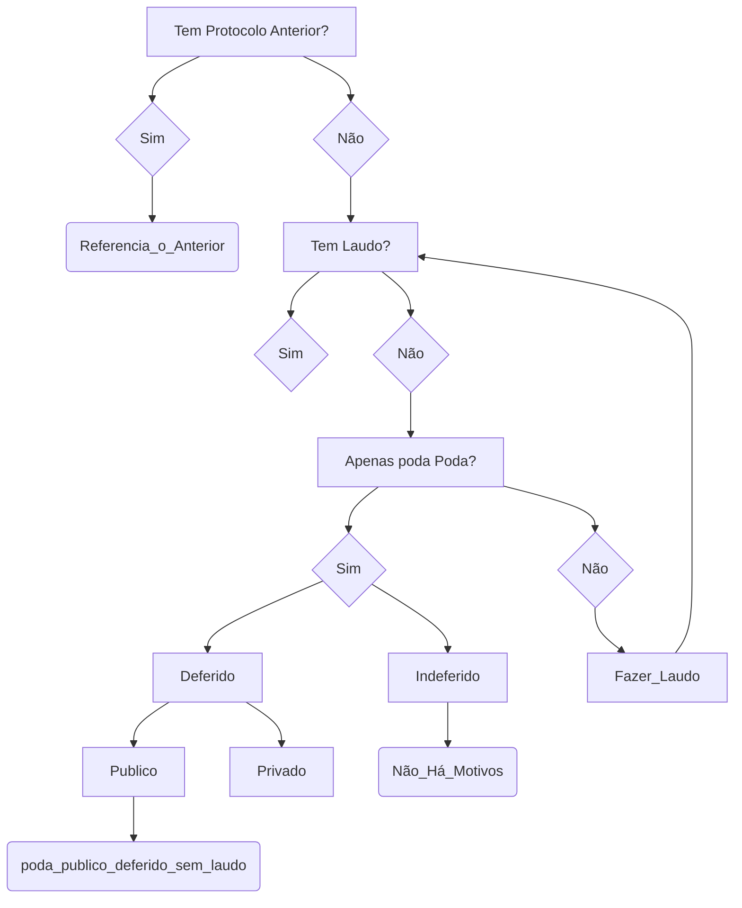

# Fluxograma de Despachos

```mermaid
graph TD

a0[Tem Protocolo Anterior?]

a0 --> S0{Sim}
a0 --> N0{Não}
S0 --> Ref_Anterior(Referencia_o_Anterior)
N0 --> 0

0[Tem Laudo?]
0 --> S1{Sim}
0 --> N1{Não}

N1 --> poda0[Apenas poda Poda?]

poda0 --> S2{Sim}
poda0 --> N2{Não}
N2 --> Fazer_Laudo --> 0

S2 --> Deferido
S2 --> Indeferido

Deferido -->  Publico
Deferido -->  Privado

Indeferido --> Ind1(Não_Há_Motivos)


Publico --> n0n1s2pubDef(poda_publico_deferido_sem_laudo)


```